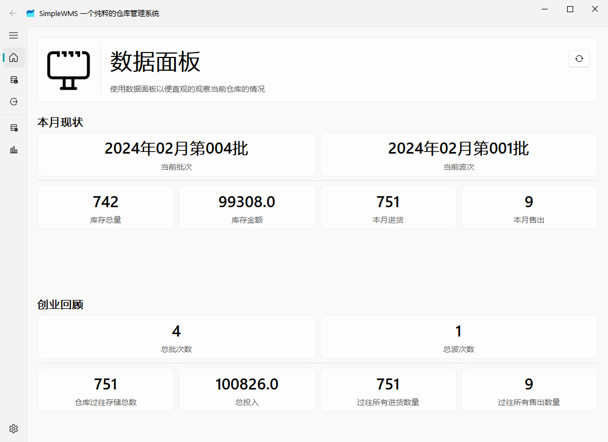
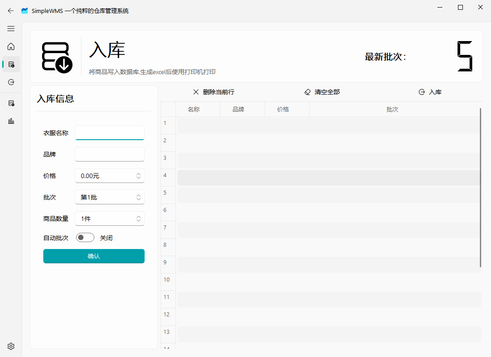
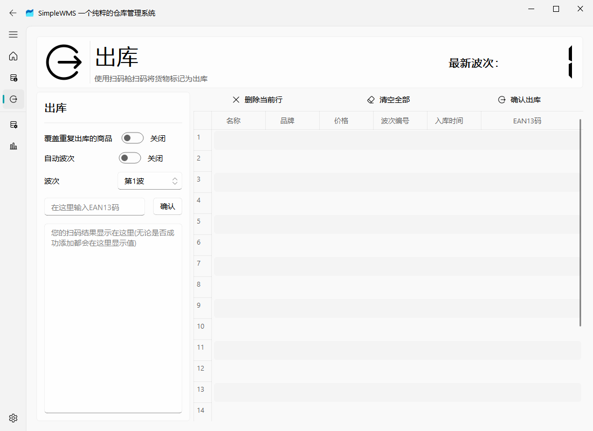
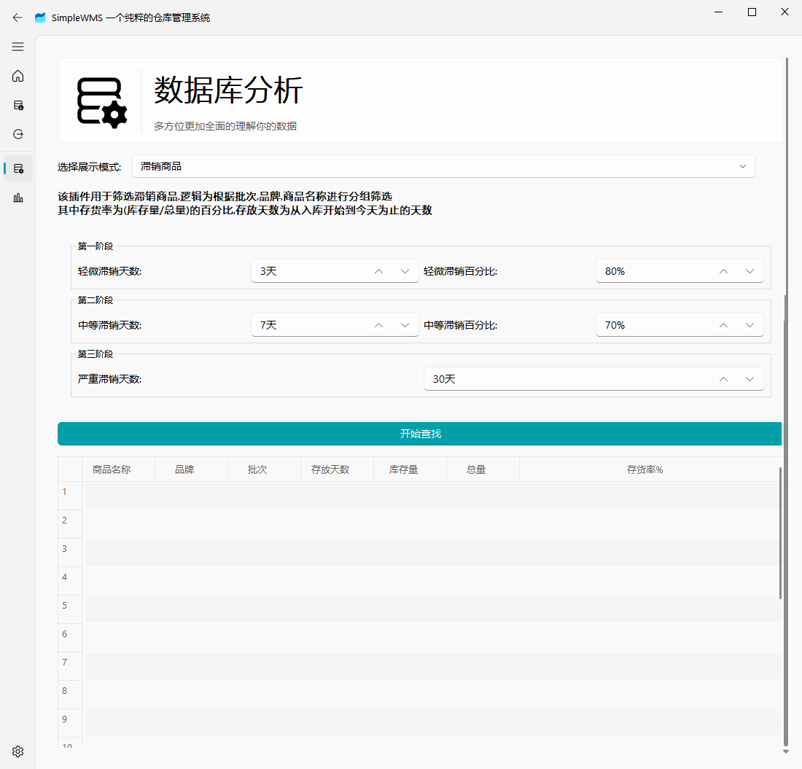

# SimpleWMS

SimpleWMS 的目标是为了给服装类抖音店铺提供简单的进销存管理系统，功能包含直观的仓库数据查看，脱销滞销管理，以及自动生成动态可视化图表，以及接入抖音平台商铺API实现更加精确的店铺管理，实现商铺仓库一体化，大幅降低财报统计的难度，解放生产力

<当前项目依然处于快速更新迭代阶段,如果您有任何建议或者意见可以通过邮件联系到我>

 

  

  <h3 align="center">SimpleWMS</h3>
  

    一个简单的仓库管理系统
     
    <a href="https://space.bilibili.com/282527875"><strong>前往作者B站 »</strong></a>
     
     
  

## 为什么选择SimpleWMS?

- 安全性: 完全离线,永久开源免费,数据保存在本地无需担心隐私问题
- 易上手: 无需复杂的配置,无需复杂的学习,无需复杂的操作,简单直观的界面,下载即可使用
- 更美观: 漂亮现代化的界面,动态图表,动态统计,实时监控仓库情况
- 高稳定: 数据库定时备份,完整日志记录,数据恢复,保证数据安全
- 兼容性(未来计划): 无需复杂的数据导入,支持Excel导入,一键导入数据，支持扫码枪，打印机
- 更全面(未来计划): 对接抖音商铺API实现更加精确的库存管理,实现商铺仓库一体化

<!-- @import "[TOC]" {cmd="toc" depthFrom=1 depthTo=6 orderedList=false} -->

<!-- code_chunk_output -->

- [SimpleWMS](#simplewms)
  - [为什么选择SimpleWMS?](#为什么选择simplewms)
  - [使用说明](#使用说明)
  - [使用说明](#使用说明-1)
    - [面板页面](#面板页面)
      - [更新页面](#更新页面)
    - [入库页面](#入库页面)
      - [自动批次](#自动批次)
      - [入库](#入库)
      - [对接打印机](#对接打印机)
    - [出库页面](#出库页面)
    - [覆盖出库](#覆盖出库)
      - [出库](#出库)
      - [对接扫码枪](#对接扫码枪)
    - [数据库分析](#数据库分析)
      - [更换查看模式](#更换查看模式)
  - [关于更新和贡献](#关于更新和贡献)
  - [鸣谢](#鸣谢)

<!-- /code_chunk_output -->

## 使用说明

**SimpleGUI 基于 Python3.10 开发,所以只支持Window10 64位系统**,其他系统暂不支持,Window11暂未测试,理论上支持

暂不支持 Mac 以及 Linux 系统,可以使用编译运行,但是不保证稳定性(未来会项目稳定了会补上编译运行的方法)

## 使用说明

通过阅读使用说明可以更好的让您上手 SimpleWMS，建议您不要跳过

### 面板页面

面板页面可以查看当前宏观的数据情况，同时了解过往的所有信息

#### 更新页面

当前版本并不会自动更新数据,点击标题栏右边的更新按钮可以更新数据

### 入库页面

该页面让您将数据存入数据库，该页面需要您手动填写数据

#### 自动批次

该页面中的自动批次可以让您无需手动输入批次，逻辑如下:检查当天是否有创建过批次，如果当天创建过批次则直接使用当天的批次，否则就创建一个新批次

您也可以手动输入批次实现将新的货物添加到过往批次中

#### 入库

在入库之前您都可以通过右侧表格进行修改，但是**一旦入库成功生成 excel 之后不要修改 excel 里的内容**，否则会导致  excel 内容与数据库内容不一致

#### 对接打印机

当前条码的输出为 EAN13 码，您可以通过使用支持电脑 excel 的打印机进行操作，即可将所有的 excel 打印为条纹码。

*建议选用热敏打印机*

### 出库页面

该页面让您将数据标记为出库，同时会为您添加波次让您了解到出库情况

### 覆盖出库

默认情况下出库时会检测当前商品是否已经出库，防止重复出库，但是如果您勾选该选项那么重复的商品将会被重复出库，**注意:重复出库会更新波次信息**

#### 出库

确认出库之后同样也会生成 excel，当前生成的 excel 仅仅只有信息展示的作用，您修改 excel 并不会直接修改数据库

#### 对接扫码枪

请您选择免 USB 驱动的扫码枪，这类扫码枪通常连接电脑之后能自动的输入信息且回车，然后您将数据先点击输入框，将给输入框设置为焦点，然后此时再进行扫码将商品出库

### 数据库分析

数据库分析页面分为两个部分，第一个部分为操作部分，第二个部分为表格展示

#### 更换查看模式

您可以通过点击上面的下拉选择框来选择当前的展示模式，当您点击开始查询之后就会更新数据到表格当中，每一个模式都会有自己的说明，当您更换模式之后他们都会相应的进行更新

## 关于更新和贡献

目前该项目不接受任何定制类开发，只接受 bug 的 issue，如果您想和我一起开发或者您有新的思路可以通过邮件联系到我pythonimporter@vip.qq.com

## 鸣谢

感谢 Pyqt-fluent-widget 项目为本项目界面提供美化基础
