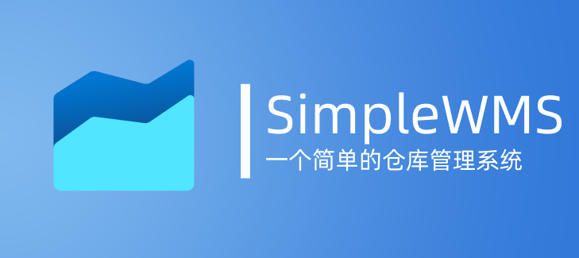

# SimpleWMS

SimpleWMS 的目标是为了给服装类抖音店铺提供简单的进销存管理系统，功能包含直观的仓库数据查看，脱销滞销管理，以及自动生成动态可视化图表，以及接入抖音平台商铺API实现更加精确的店铺管理，实现商铺仓库一体化，大幅降低财报统计的难度，解放生产力

<当前项目依然处于快速更新迭代阶段,如果您有任何建议或者意见可以通过邮件联系到我>

 

  
  <h3 align="center">SimpleWMS</h3>
  

    一个简单的仓库管理系统
     
    <a href="somethingcool.top/SimpleWMS/"><strong>前往查看文档 »</strong></a>
    <a href="https://space.bilibili.com/282527875"><strong>前往作者B站 »</strong></a>
     
     
  

## 为什么选择SimpleWMS?

- 安全性: 完全离线,永久开源免费,数据保存在本地无需担心隐私问题
- 易上手: 无需复杂的配置,无需复杂的学习,无需复杂的操作,简单直观的界面,下载即可使用
- 更美观: 漂亮现代化的界面,动态图表,动态统计,实时监控仓库情况
- 高稳定: 数据库定时备份,完整日志记录,数据恢复,保证数据安全
- 兼容性: 无需复杂的数据导入,支持Excel导入,一键导入数据，支持扫码枪，打印机

前往这里查看更加详细的入门教程和更多说明文档: http://somethingcool.top/SimpleWMS/

## 图片速览

### 清晰明了的数据主页面板

### 入库和出库页面

### 数据库查看页面

通过大量的内置插件让您可以自由的筛选您的数据

### 可视化图表快速展示

通过可视化的图表来更加深入的了解您的仓库，未来会更新更多的图表

### 丰富的设置页面

## 关于更新和贡献

目前该项目不接受任何定制类开发，只接受 bug 的 issue，如果您想和我一起开发或者您有新的思路可以通过邮件联系到我pythonimporter@vip.qq.com

## 鸣谢

感谢 Pyqt-Fluent-Widget 项目为本项目界面提供美化基础