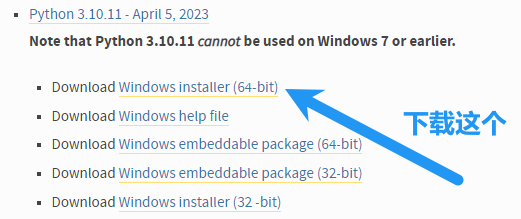

# Window10编译部署

## 下载 Python 3.10.11 版本



或者直接点击下载下面的这个下载链接

https://www.python.org/ftp/python/3.10.11/python-3.10.11-amd64.exe

然后一路确认，记得将 Python 添加到 Path 里面

然后将项目 clone 到本地

```bash
git clone https://github.com/271374667/SimpleWMS.git
```

等待下载完成之后进入项目文件夹安装依赖后即可运行

```bash
cd SimpleWMS
pip install -U -r requirement.txt
python SimpleWMS
```

