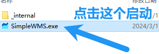

# 直接使用

在开始之前先确保自己的版本为 Window10 64位

通过直接点击目录下的 SimpleWMS.exe 就能启动程序，无需其他操作

## 关于更新

每一次更新都是全量更新，以后也不会考虑软件内部更新， 每一次更新请都前往 GitHub 进行更新，每一次更新我都尽量保证直接覆盖原文件即可完成升级，**升级之前不要尝试启动新版本的SimpleWMS，因为启动会生成新的 `database.db`，如果此时再覆盖会导致老数据库的丢失**，给您造成大量经济损失，如果有少量版本无法直接覆盖，出现大量更新我也会给出提示并且给出升级方式，让您可以放心的从老版本升级到新版本呢

在每一次升级前请先保证您备份了数据库，请参考 *"手动数据库备份和恢复"*，虽然每一次升级都会进行测试，但是仍有可能出现极小概率事件，所以请备份您的数据库