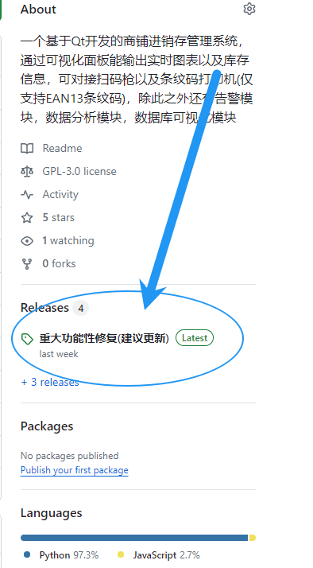
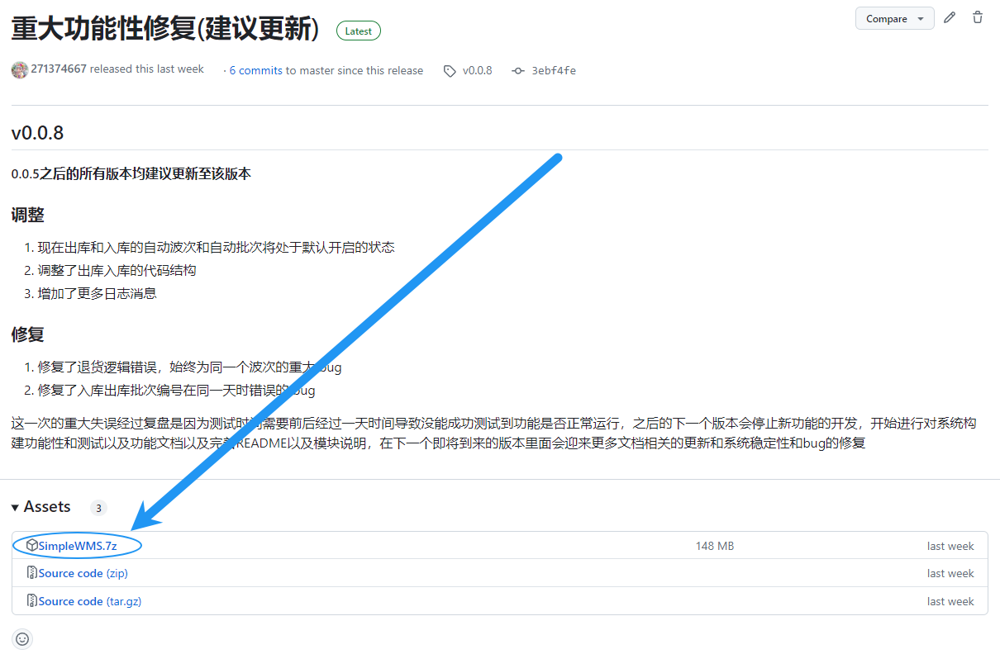

# 下载说明

目前仅提供 GitHub 的下载方式，之前本来在 Gitee 上也放了一份，但是 Gitee 要求每一个 zip 都要小于 100 MB 所以没有办法最后放到了 GitHub

## GitHub Release

进入 release 页面

然后下载其中 SimpleWMS.7z 文件 

下载完成之后直接请**解压之后**，打开即可使用

**注意，打开之后不要直接覆盖老版本，会导致数据全部丢失**，如何安全升级你的 SimpleWMS 请看部署帮助

## 各类 GitHub 镜像站

如果您觉得自己的下载速度非常慢，或者根本打不开 GitHub 可以考虑进入 GitHub 的镜像站进行下载，请注意不要在镜像站里面进行登陆操作

不保证下面的镜像站稳定可用，如果失效请自行寻找其他的镜像站

- https://hub.nuaa.cf/271374667/SimpleWMS
- https://hub.yzuu.cf/271374667/SimpleWMS
- https://kgithub.com/271374667/SimpleWMS
- https://hub.njuu.cf/271374667/SimpleWMS