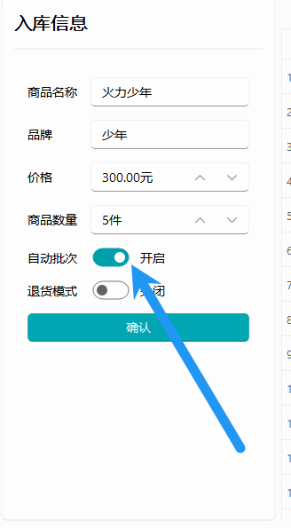
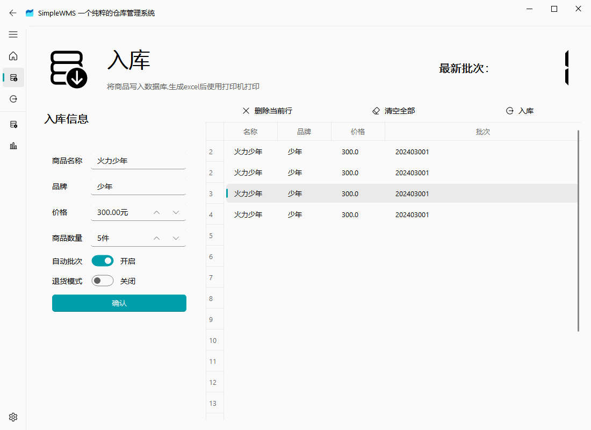
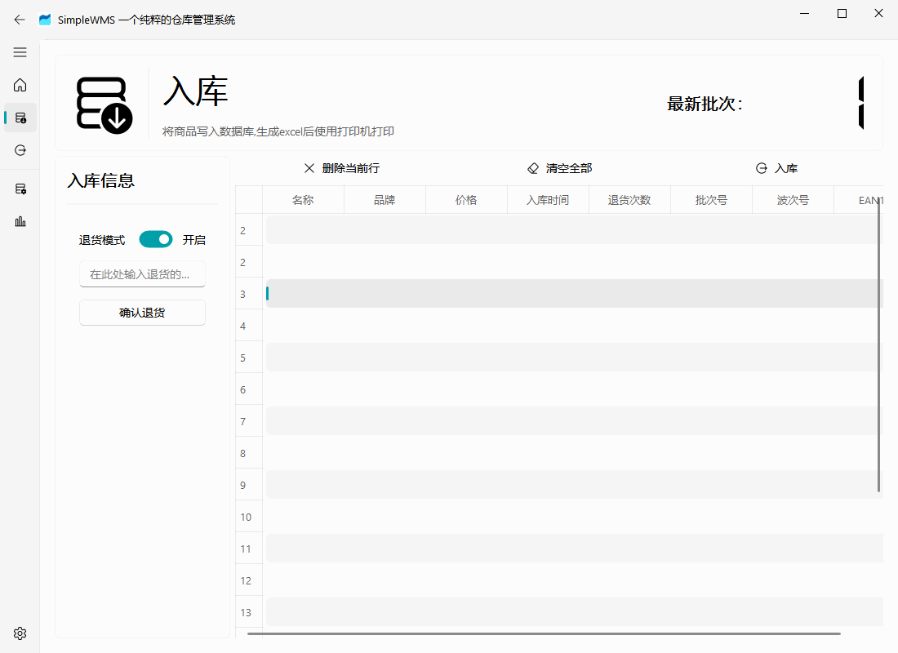
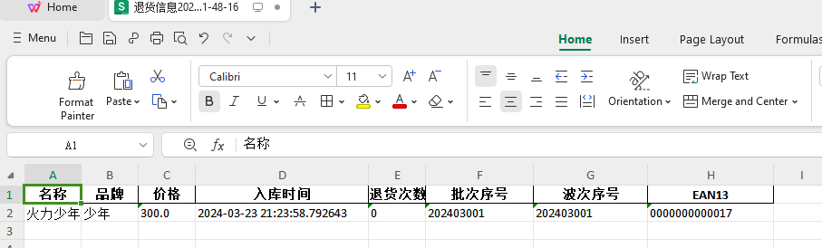

# 入库页说明

## 什么是批次？

在电商中通常进货都是一次购入大量服装，其中把某一个统一购入的这一批货物成为同一批，这样方便后期出现问题的定位，比如客户突然返回某一个商品有问题，后来经过排查发现是某一个批次的商品有问题，此时就可以直接召回同一批的商品或者查看还有还多少同类商品存储在库存中

## 自动批次的逻辑

在入库的选项中有一个自动批次的选项

该选项为了缓解大量进货的操作过多所以默认开启，该选项的逻辑如下:

1. 如果今天有购入过批次那么默认就会将这一批货物加入今天的这一批次，比如今天上午收了一批货，晚上收了一批货，但是这两批货都在同一天，所以将他们归为同一批
2. 如果今天没有任何批次，那么则会在最新的批次上面加1，比如昨天的批次为001，那么今天创建的最新批次将会是002

**每一个月有批次上限，同一个月内最多只能创建999个批次**

## 退货模式

退货模式是负责将已经出库的商品重新入库，此时会增加商品的退货次数，同时将商品重新设置为未售出状态，同时清除该商品的波次(波次是什么请见出库页帮助文档)

此时在退货中输入你需要重新入库的 EAN13 码，商品就会重新入库

然后会在输出文件夹生成当前退货商品的消息，以及显示商品的曾经退货次数(注意该次数是除去本次退货，)

