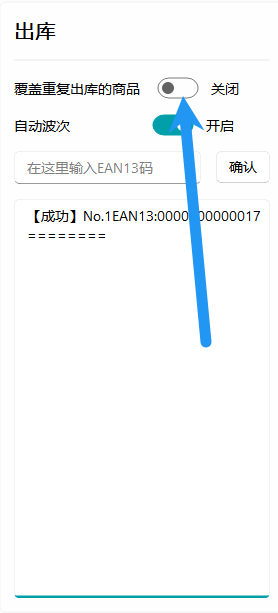
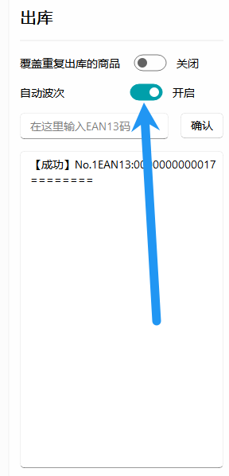
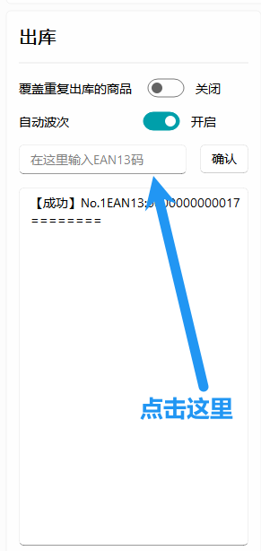

# 出库页说明

## 什么是波次？

和批次一样，通常卖货不是卖出一件就发一件，而是比如在晚上或者下午的某一个时间点将今天一整天卖的商品全部发出去，这样可以节省人力成本，这些被一起发出去的商品被称为同一波次，通过同一波次可以定位到哪些商品是被同时发出去的，通过波次就能锁定快递订单

## 覆盖重复出库的商品

通常情况下，如果一个商品已经出库了，那么你无法将它重新出库，SimpleWMS 会提示你商品已经出库，但是你可以通过开启该选项来让商品重新出库，如果使用该选项重新出库商品会刷新商品的波次

## 自动波次的逻辑

在出库的选项中有一个自动波次的选项

该选项为了缓解大量进货的操作过多所以默认开启，该选项的逻辑如下:

1. 如果今天有购入过波次那么默认就会将这一批货物加入今天的这一波次，比如今天上午收了一批货，晚上收了一批货，但是这两批货都在同一天，所以将他们归为同一批
2. 如果今天没有任何波次，那么则会在最新的波次上面加1，比如昨天的波次为001，那么今天创建的最新波次将会是002

**每一个月有波次上限，同一个月内最多只能创建999个波次**

## 关于扫码枪的使用

在使用扫码枪扫码输入之前你需要先将鼠标点击输入框来激活焦点，此时 SimpleWMS 才能获取到您的输入

