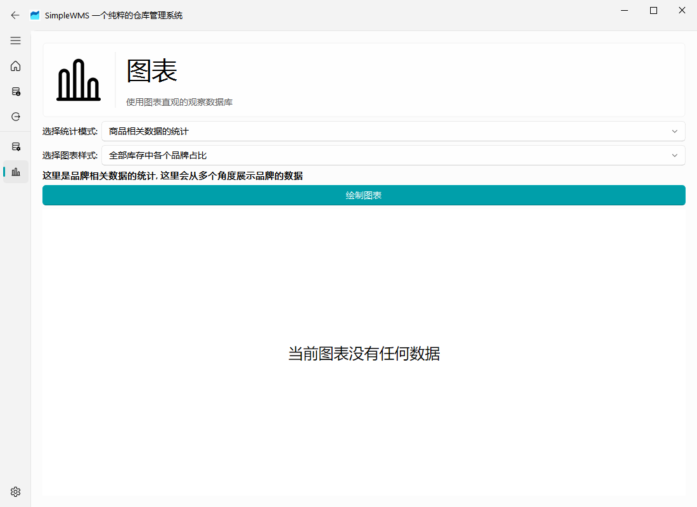
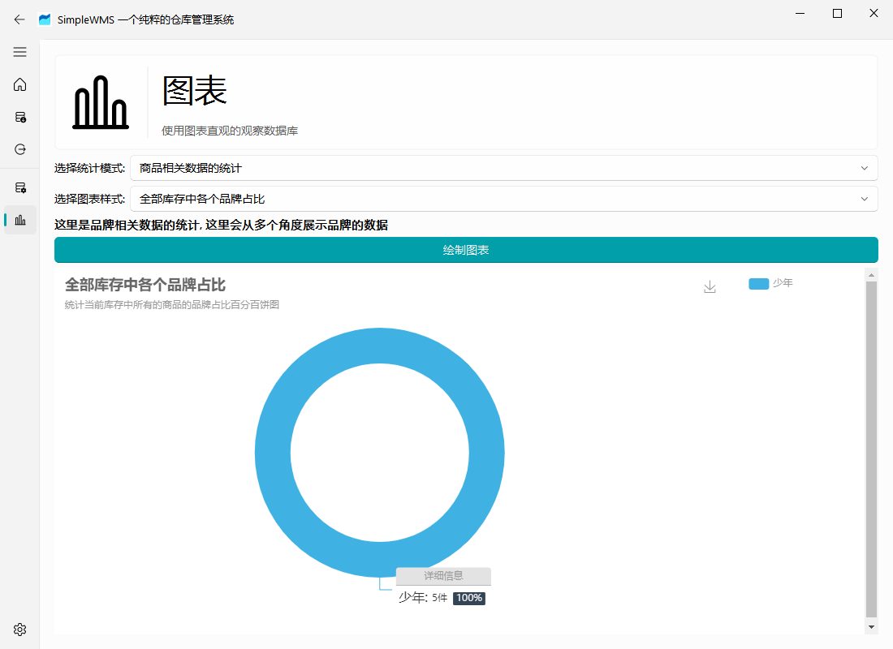
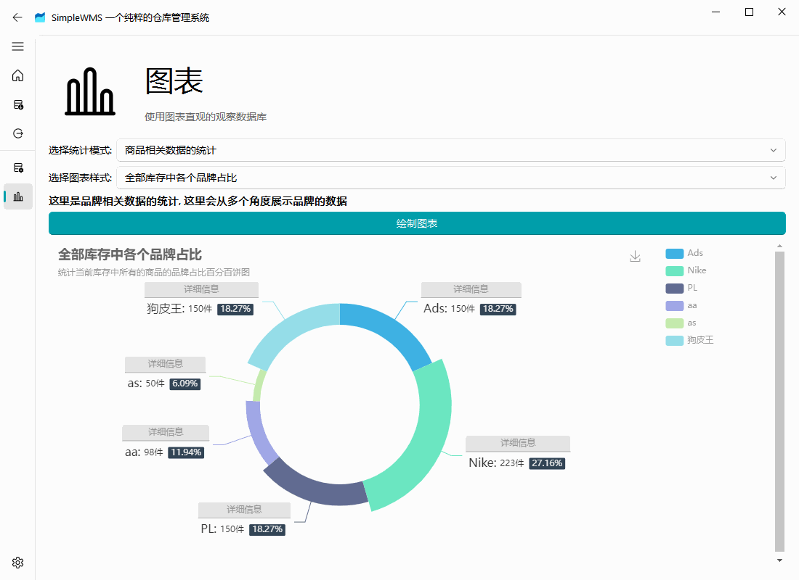

# 图表页面

## 为什么我的图表没有数据？

如果您出现以下页面说明当前数据库内没有任何数据，请您重新添加数据，或者从外部导入数据库

当您数据库中有数据之后点击绘制图表就能查看到当前的图表

## 切换模式

和数据库查看页面一样，您可以通过切换统计模式和切换图表样式来切换不同的图表，从多方面来查看当前数据库的情况

## 额外说明

图表页面当前尚未稳定，未来的图表中的选项或者顺序都有可能会发生改变