# 基础使用

第一次拿到软件，启动会自动在本地创建一个数据库，您可能会看到下面的画面

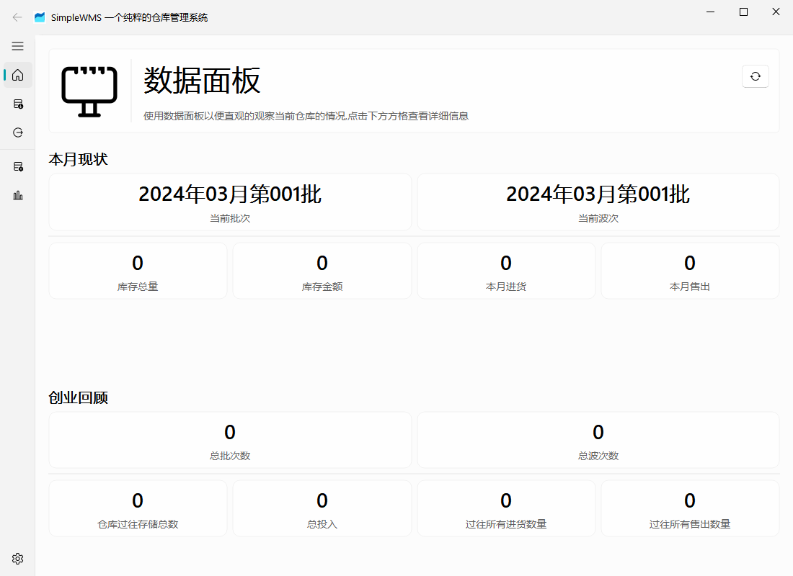

## 账号管理

SimpleWMS拥有账户管理系统，通常情况下您第一次打开的时候是

## 入库

现在在页面的左侧找到入库的图表即可进入入库页面

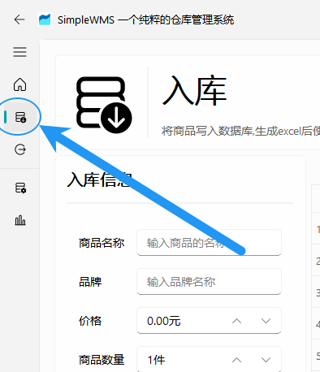

在入库页面内填写商品的名称，品牌，价格，商品数量等内容之后点击确定即可将内容添加到表格内

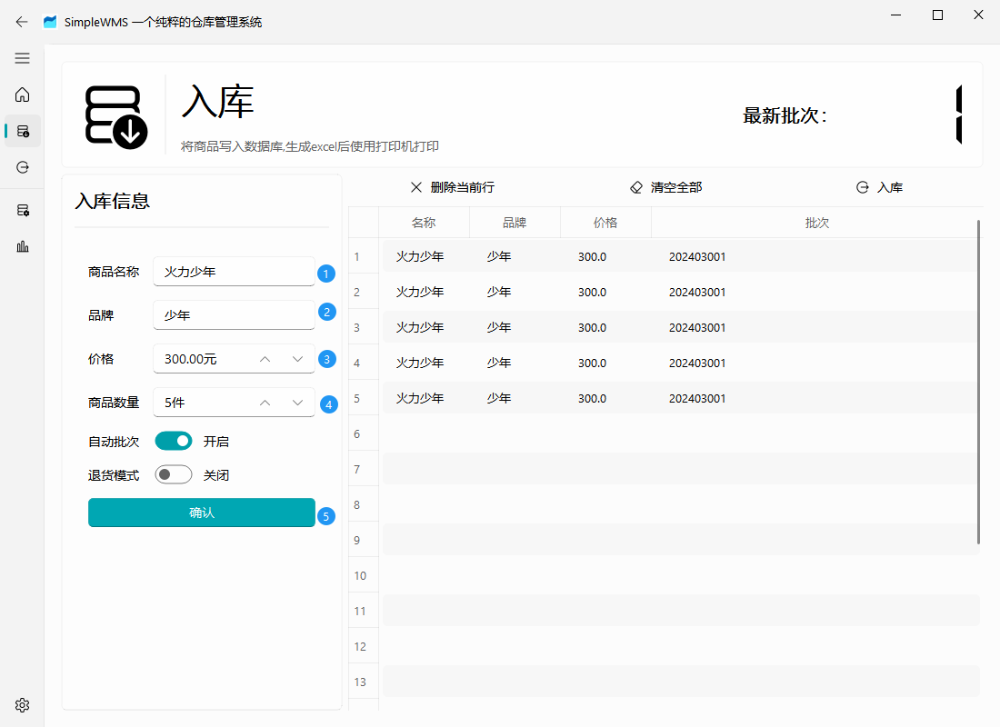

此时检查表格内容是否正确，如果出现错误可以直接在表格内双击进行编辑

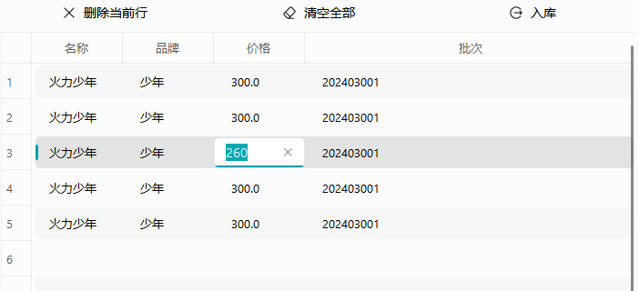

当你检查无误之后点击右上角的入库即可成功将商品导入进数据库，同时会生成一份 excel 告诉您本次您导入的数据

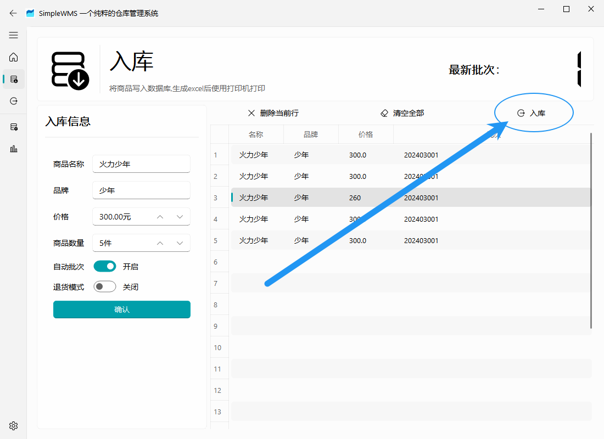

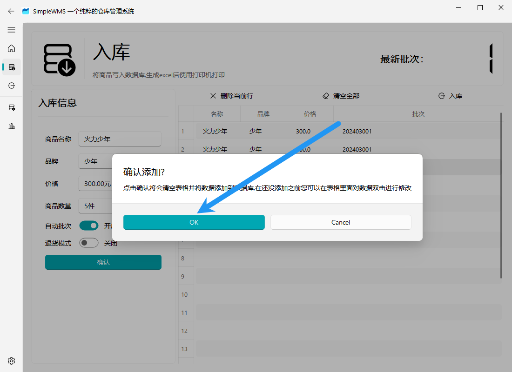

等待导入完毕，SimpleWMS会为每一个商品都会分配一个不同的 EAN13 码以此来区分不同的商品

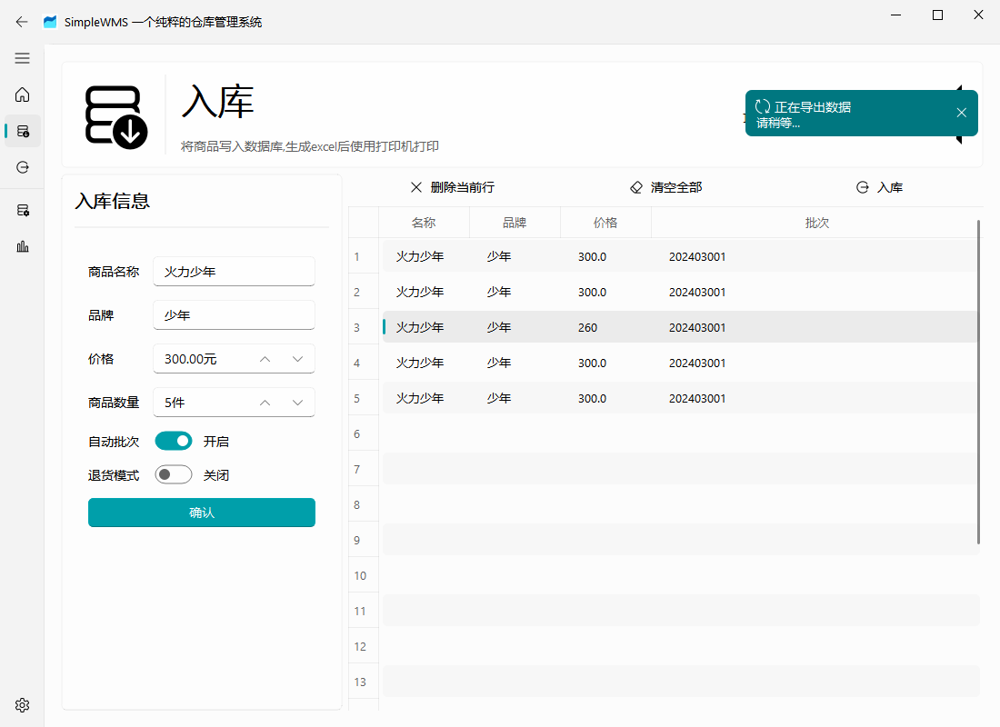

等待导入完成之后会打开生成 excel 的目录，你可以在里面找到这一次添加入库的数据

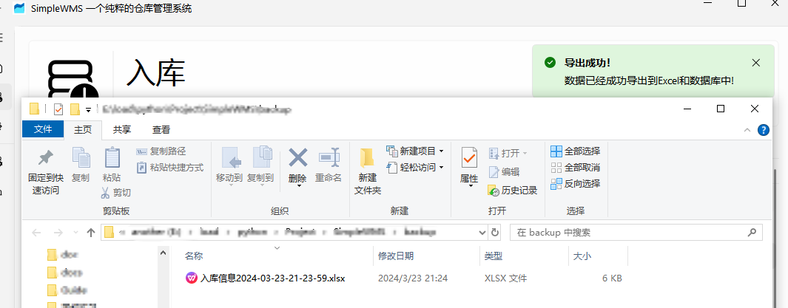

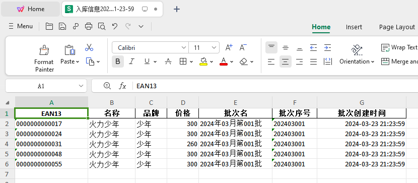

在入库之前您都可以通过右侧表格进行修改，但是**一旦入库成功生成 excel 之后不要修改 excel 里的内容**，否则会导致  excel 内容与数据库内容不一致

### 打印机打印数据

现在在电商平台购买可以打印 Excel 的打印机，根据商家的操作说明将该 Excel 里面的内容打印成条码粘贴在商品上

*建议选用热敏打印机*

## 出库

进入出库页面

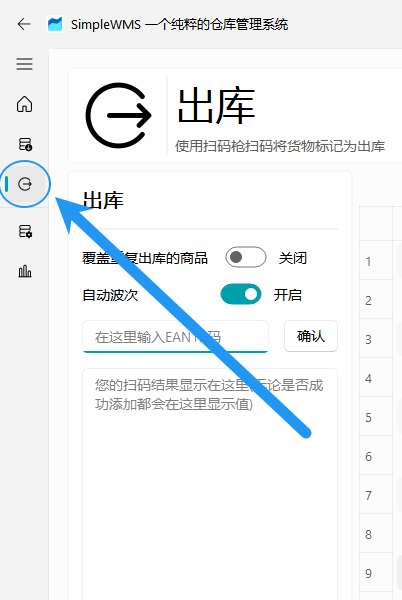

在此处输入之前导入的 EAN13 码，您也可以前往电商购买 usb 的扫码枪(类型请前往本说明文档的外设页面查看)

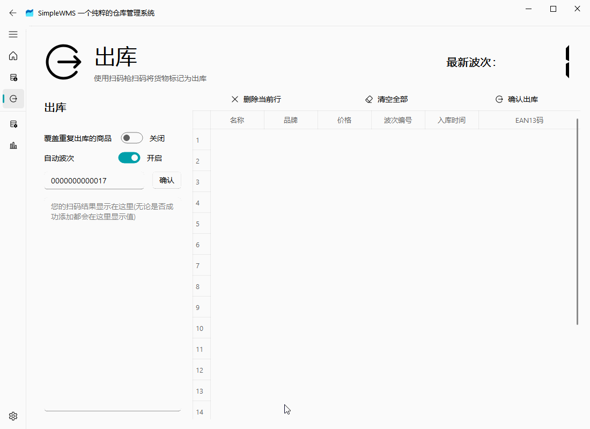

然后此时点击出库，等待出库完成

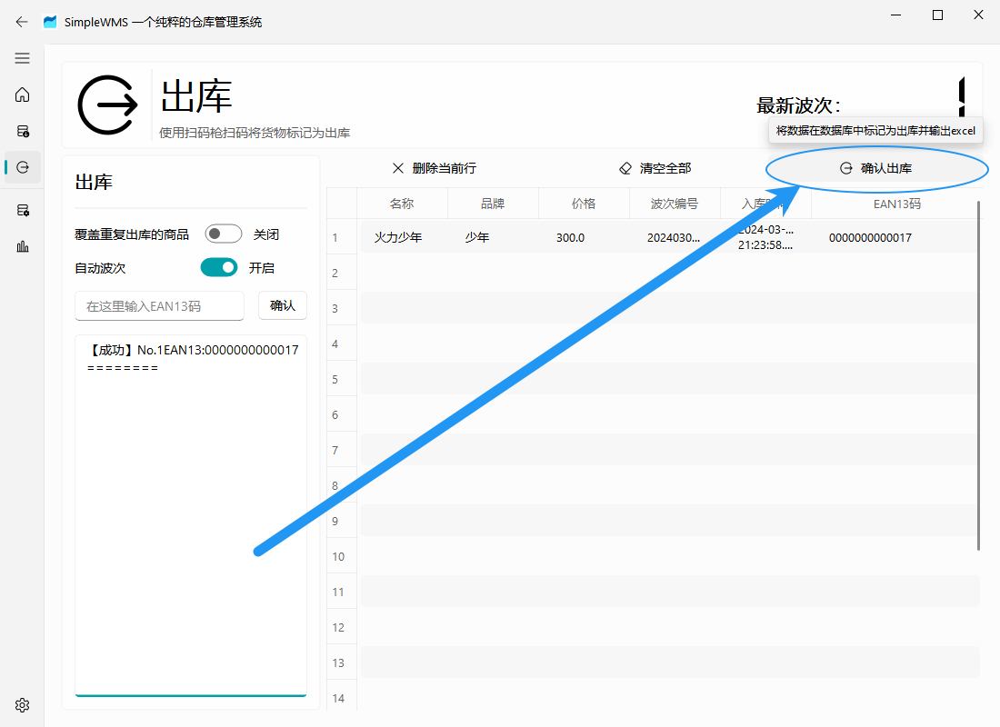

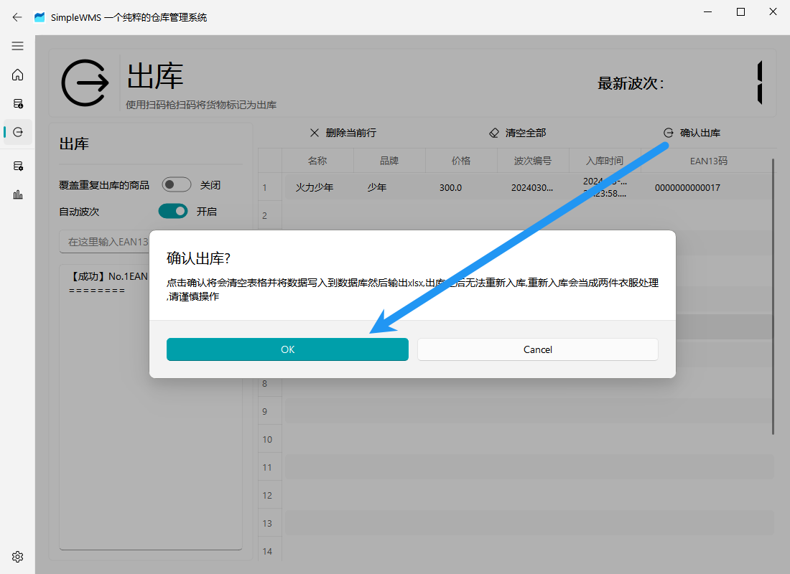

然后此时提示出库成功，前往出库页面就可以查看本次的出库内容

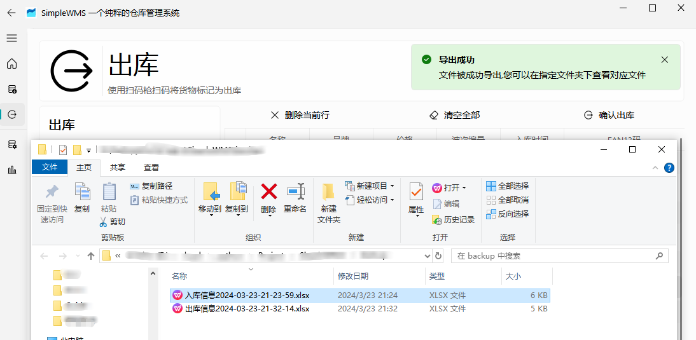

打开文档可以看到下面的消息

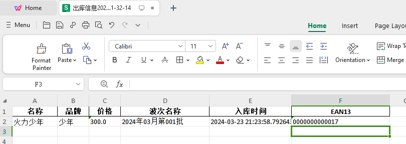

确认出库之后同样也会生成 excel，当前生成的 excel 仅仅只有信息展示的作用，您修改 excel 并不会直接修改数据库

## 主页面板

现在可以回到主页面板，刷新一下就能看到最新添加的数据了

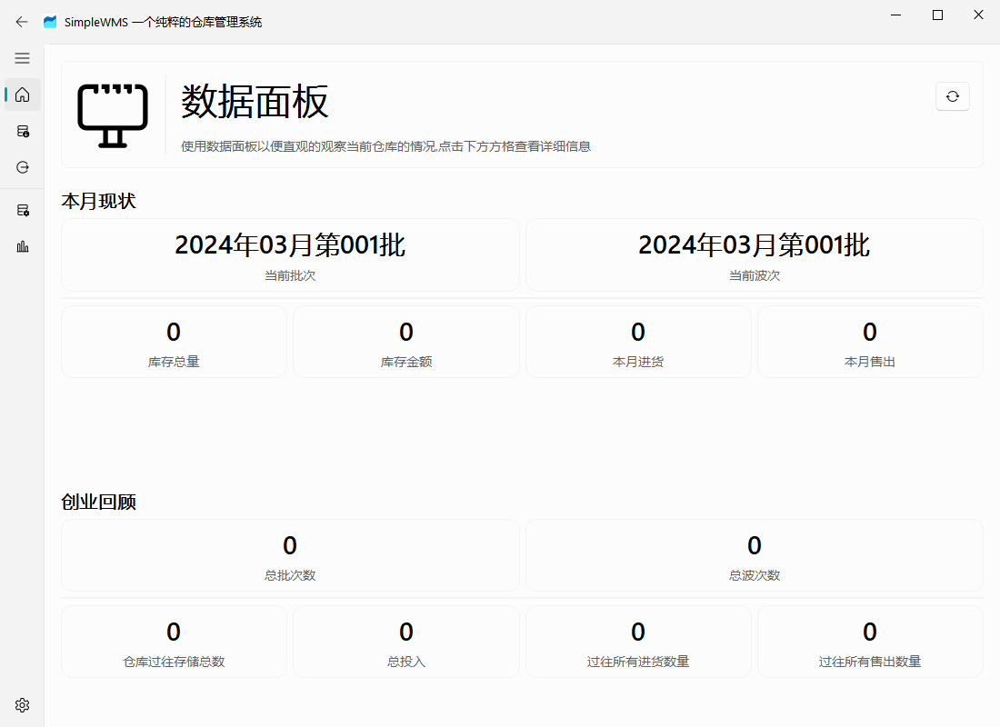

同时也可以通过点击每一个面板来查看具体的数据

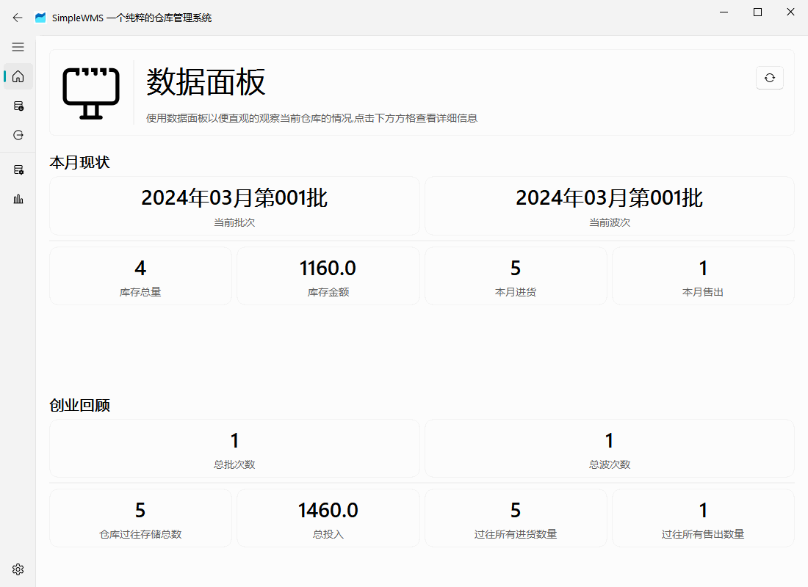