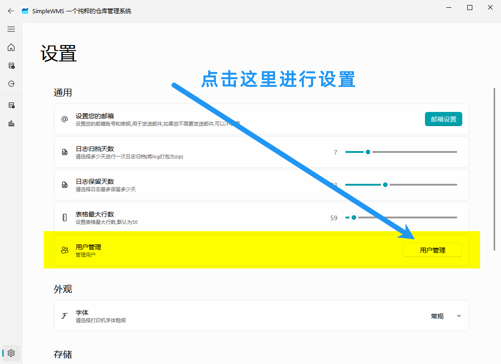
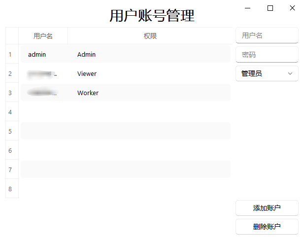
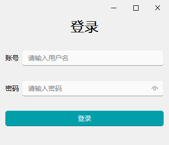

# 基础使用

第一次拿到软件，启动会自动在本地创建一个数据库，您可能会看到下面的画面

## 账号管理

SimpleWMS拥有账户管理系统，通常情况下您第一次打开的时候是管理员，且不需要登陆，如果您需要使用账号系统来对访问者进行分类，您可以在进入到页面后进入到设置页面下面通过设置

此时如果您再进入软件就能发现现在想要进入软件需要登录，**请您牢记您的密码，密码失去后无法找回**

### 权限说明

目前一共有 3 种权限

| 页面访问权\权限 | 管理员 | 访问者 | 编辑者 |
| --------------- | ------ | ------ | ------ |
| 主页            | √      | √      | ×      |
| 入库页面        | √      | ×      | √      |
| 出库页面        | √      | ×      | √      |
| 数据库查看页面  | √      | √      | ×      |
| 图表展示页面    | √      | √      | ×      |
| 设置页面        | √      | ×      | ×      |

简略的说明一下就是管理员可以访问全部的功能，访问者只能进行查看，无法进行出库入库操作，而编辑者只能进行入库出库，不能查看当前库存的状态(可以让员工不知道库存信息)

## 入库

现在在页面的左侧找到入库的图表即可进入入库页面

在入库页面内填写商品的名称，品牌，价格，商品数量等内容之后点击确定即可将内容添加到表格内

此时检查表格内容是否正确，如果出现错误可以直接在表格内双击进行编辑

当你检查无误之后点击右上角的入库即可成功将商品导入进数据库，同时会生成一份 excel 告诉您本次您导入的数据

等待导入完毕，SimpleWMS会为每一个商品都会分配一个不同的 EAN13 码以此来区分不同的商品

等待导入完成之后会打开生成 excel 的目录，你可以在里面找到这一次添加入库的数据

在入库之前您都可以通过右侧表格进行修改，但是**一旦入库成功生成 excel 之后不要修改 excel 里的内容**，否则会导致  excel 内容与数据库内容不一致

### 打印机打印数据

现在在电商平台购买可以打印 Excel 的打印机，根据商家的操作说明将该 Excel 里面的内容打印成条码粘贴在商品上

*建议选用热敏打印机*

## 出库

进入出库页面

在此处输入之前导入的 EAN13 码，您也可以前往电商购买 usb 的扫码枪(类型请前往本说明文档的外设页面查看)

然后此时点击出库，等待出库完成

然后此时提示出库成功，前往出库页面就可以查看本次的出库内容

打开文档可以看到下面的消息

确认出库之后同样也会生成 excel，当前生成的 excel 仅仅只有信息展示的作用，您修改 excel 并不会直接修改数据库

## 主页面板

现在可以回到主页面板，刷新一下就能看到最新添加的数据了

同时也可以通过点击每一个面板来查看具体的数据

