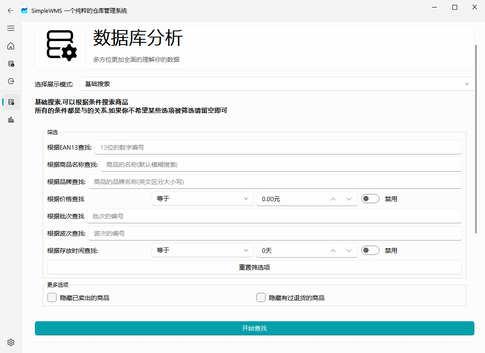
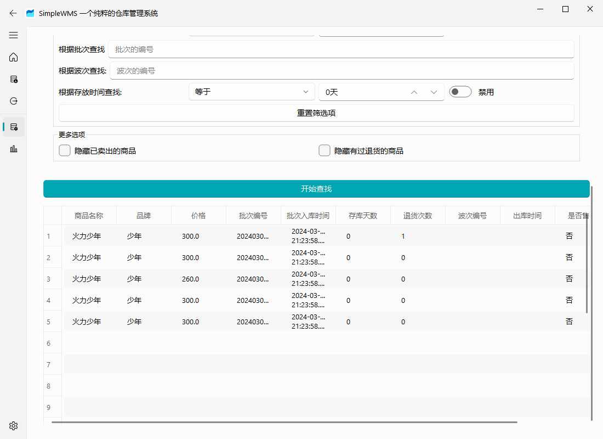
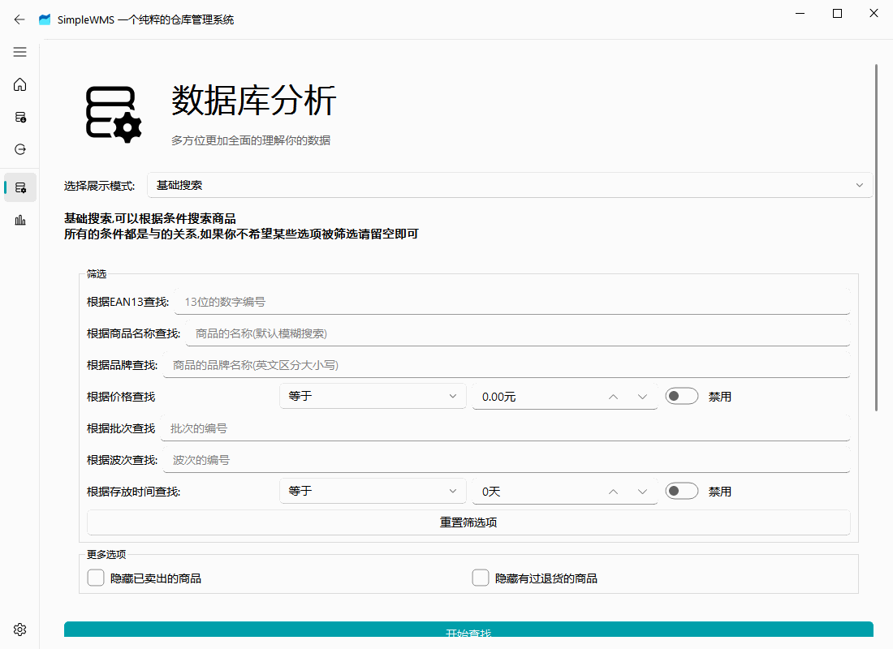

# 数据库查看页面

数据库查看页面可以让你更加全面的查看当前数据库，你可以通过更加快捷的方法拿到数据库内的数据

## 如何筛选数据库内数据

进入默认的页面，默认的展示模式为 “基础搜索”，在该模式下有大量的筛选选项你可以同时选择，最终将会根据你设置的筛选条件将**符合所有条件**的数据给寻找出来

点击开始查找，然后拖动滚动条在下面就能看到本次筛选的数据

## 切换模式

你可以通过点击切换展示模式来切换当前的数据库查找模式，但是请注意，切换展示模式并不会清空前一次的表格输出

